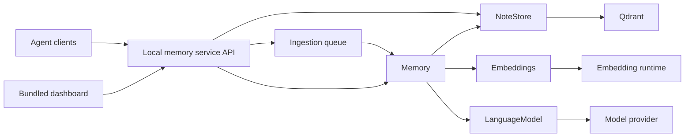

# Agentic Memory high-level architecture

## Components

The system provides a reusable library and a separate local memory service. The service owns API
access and shared resources; the five underlying components remain independently usable through
their public contracts.

| Component       | Owns                                                                                                                                        |
| --------------- | ------------------------------------------------------------------------------------------------------------------------------------------- |
| Service         | HTTP API, provider lifecycle, shared encoder and availability reporting                                                                     |
| Ingestion queue | Durable acceptance, source-key deduplication, writer ownership, explicit recovery, maintenance-plan durability and restart replay           |
| Memory          | Public memory operations, note construction and evolution decisions, prompt assembly, model-output interpretation and retrieval composition |
| NoteStore       | Durable note and vector records, identity lookup, similarity search and paginated inspection                                                |
| Embeddings      | Text-to-vector conversion and the identity and configuration of the embedding space                                                         |
| LanguageModel   | Model invocation, provider protocol and operational settings, returned output and invocation failure                                        |

The host supplies source material, selects implementations and settings, owns credentials and
controls their lifecycle. Library composition wires the supplied capabilities; it does not discover
Nexus configuration or launch an agent workflow. Experiments and graph inspection are consumers of
the public library, not part of its operating path.

## Relationships and replacement

Memory uses the public contracts of NoteStore, Embeddings and LanguageModel. Those providers do not
depend on Memory's orchestration or on one another. Their concrete integrations own external SDKs
and protocols. Composition selects them outside memory operations. Cross-component imports,
including types, use public interfaces; dependency cycles and imports of provider internals are
not allowed.

The NoteStore public contract owns the persisted note record exchanged with Memory. Memory owns
the meaning of construction and evolution and its public input and retrieval results. Model-output
schemas belong to Memory, which interprets them; LanguageModel transports output without deciding
whether a proposed relationship or update is valid.

Replacement means preserving observable data, ordering, failure and lifecycle promises, not merely
matching method names. A Qdrant client parameter alone is not a replaceable storage boundary.

## Public contracts

| Provider        | Capability                                                     | Observable promise                                                                                                                                                      |
| --------------- | -------------------------------------------------------------- | ----------------------------------------------------------------------------------------------------------------------------------------------------------------------- |
| Memory          | Add source content with optional timestamp and provenance      | Assign a new note identity, construct semantic attributes, consider related stored notes and persist the resulting note and accepted evolution before reporting success |
| Memory          | Search text with direct-match and linked-expansion limits      | Return ranked similarity matches followed by bounded, distinct linked additions; include complete notes and identify how each was retrieved                             |
| Memory          | Read a note or inspect a page                                  | Expose current stored notes without model interpretation or generation                                                                                                  |
| NoteStore       | Write note/vector records                                      | Preserve supplied identities and values and report completion or failure; do not infer relationships or regenerate semantic fields                                      |
| NoteStore       | Read identities, search vectors, inspect pages                 | Return current records, ranked similarity scores and bounded pages without requiring a collection scan in normal insertion or search                                    |
| Embeddings      | Embed text                                                     | Return a vector in the configured embedding space or an explicit failure; document its model and encoding configuration                                                 |
| LanguageModel   | Invoke a model with assembled instructions and source material | Return model output or an explicit invocation failure; provider settings do not change the memory response contract                                                     |
| Ingestion queue | Submit observations and read receipt status                    | Accept durably after the local commit, deduplicate by source key, drain in acceptance order through one writer and replay persisted insertion plans after a restart     |

Detailed contracts belong to [Memory](memory.md), [NoteStore](note-store.md),
[Embeddings](embeddings.md), [LanguageModel](language-model.md),
[ingestion queue](ingestion-queue.md) and [prompts](prompts.md).
The [paper alignment audit](paper-alignment.md) distinguishes the research mechanism from our
engineering and experimental choices.

## Service deployment

The [local service](service.md) is the shared access point for concurrent agents. It owns one encoder
and collection, accepts durable submissions, and serves retrieval and paginated inspection. Its
supervised process outlives client tasks. Clients configure the API URL; the service owns database
and model credentials. The [queue](ingestion-queue.md) owns sequential writes and restart recovery.
Operators recover known-unwritten failed observations through the service's receipt-recovery route.
For a reviewed existing-context correction, stop the service and use its offline maintenance command:
the queue takes the same writer ownership, Memory prepares the replacement, and the queue commits
and applies that exact plan. A pending maintenance plan replays before ingestion on restart. Neither
agent clients nor the read-only dashboard gain context-editing controls or direct database access.
The bundled inspection module shares the service listener and read capabilities; its background
worker owns projection, not another encoder or database client.

## Library composition

The host loads a configured embedder, opens or creates compatible storage using its declared space
and the representation version, supplies a LanguageModel implementation, and constructs AgenticMemory.
Initialization fails before the instance is exposed if a provider is unavailable or incompatible.
No component starts Qdrant, reads Nexus secrets, downloads an implicit model or discovers another
component. The host owns provider resources and their shutdown; it waits for pending writes first.

Provide a minimal Linux/WSL host example using public exports and externally supplied settings.
The built package must be usable by another directory without repository-relative or prototype
imports. The example demonstrates add, search and inspection, not a hosted HTTP service. Experiments
wrap the same public boundaries to record evidence and use separate disposable collections.

## Note model

A note contains a stable ID, immutable original content and timestamp, optional opaque provenance,
generated context, keywords and tags, and directed links to other note IDs. NoteStore retains its
embedding with the record, plus an optional persisted last-update time for inspection. Evolution
changes semantic attributes and advances update time for actual changes; it does not rewrite source
content, identity, timestamp or provenance. Storage represents the current note, not a permanent revision log.

The embedding represents original content together with generated context, keywords and tags.
Its dimensions come from the encoder, not from the number of tags. Provenance is returned to callers
but is not automatically included in prompts or embeddings. A source distinction required for
interpretation must therefore be present in the supplied content.

Each insertion creates a new identity. Identical content can occur in more than one note; there is
no content-based deduplication or caller-ID conflict mechanism.

## Insertion and evolution

1. Construct concise context, keywords and tags from the incoming content and resolved timestamp.
2. Embed that representation and retrieve a bounded nearest-neighbor set.
3. Ask the model which candidate relationships to retain and which neighboring semantic attributes
   should evolve. Linking and evolution may share an invocation.
4. Validate the proposed output and referenced candidate IDs, prepare updated embeddings and persist
   the new note and accepted changes.

Model proposals may refer only to supplied candidates. New links point from the incoming note to
selected existing notes; reciprocal links are not automatic. A changed neighbor is re-embedded;
its change does not recursively trigger another evolution pass. The process does not merge or prune
notes, create topic summaries or scan every stored source on each insertion.

Construction and evolution instructions can be configured independently. Memory retains the response
contract and source-data envelope. Defaults request concise, source-attributed context that preserves
claim strength, conditions, exceptions and scope. Opaque workflow identifiers remain in original
content and provenance rather than being repeated in generated context merely for bookkeeping.
Structural validation establishes acceptable output shape and references, not semantic truth.
The [quality requirements](memory-quality-requirements.md) and
[experience](memory-quality-experience.md) retain these boundaries. Generation improvements stay in
Memory's owned prompts/envelope; transport stays provider-neutral and strict validation still precedes
writes. Evaluate concise context and meaningful links at creation/evolution rather than introducing
a retrieval-time model or changing search policy. Precise audited response defects remain unconfirmed
until retained evidence or a representative reproduction identifies them.

## Retrieval

Search embeds the query, asks NoteStore for ranked direct matches and optionally follows their
outgoing links for one bounded hop. It returns each note at most once, keeping direct-match order
and distinguishing linked additions from scored matches. A zero linked limit disables expansion.
Search makes no language-model calls.

Results include original content, current semantic attributes, links and provenance. The host decides
what to put in an agent's context. The library does not answer the query or claim that every returned
rule applies. Jurisdictions and other scope distinctions are semantic content, not mandatory metadata
filters; related notes from different scopes may appear together with their attribution preserved.

## Operational boundary

The initial deployment permits one active writer per collection. Memory serializes insertions within
its instance; the host must not run competing writer instances against that collection. Retrieval may
run during insertion and does not promise a transactionally consistent view across several notes.

Model-output validation and required embedding work complete before writes begin. A failure before
that boundary leaves stored notes unchanged. Storage failures or interrupted acknowledgments can
leave an uncertain or partial write; they must not be presented as success or as guaranteed rollback.
The library does not automatically repeat an entire uncertain insertion, which could create a second
note. The host receives the affected operation's identity and failure stage for diagnosis.

Raw add consumers must respect these outcomes and the single-writer constraint. The
[failure contract](memory.md#failures) provides diagnosis rather than automatic crash recovery;
[transport behavior](language-model.md#transport-behavior) specifies the retry boundary. This design
does not assume Qdrant provides a multi-note transaction.

For concurrent producers and automatic recovery, compose the [durable ingestion queue](ingestion-queue.md).
Its independent local worker owns all collection mutations and persists prepared insertion plans
before applying them. The service API can accept work while providers or its ingestion worker are unavailable.
Preparation and application use public Memory contracts; reads continue through the ordinary API.

A collection uses one declared embedding model and encoding configuration. Compatibility must not
be inferred from vector dimensions alone. Model replacement that changes the embedding space requires
an explicit re-embedding decision, not an unnoticed configuration swap.

Insertion and retrieval work is bounded by neighborhood and result limits rather than total corpus
size at the library boundary. Source length and selected-neighbor size still affect model cost;
bounded note count is not a token or latency guarantee. Production scale requires measurement.

## Local inspection tool

The [Sigma dashboard](dashboard.md) is bundled into the [local service](service.md#bundled-dashboard).
One process and listener serve the UI, inspection routes and memory API. Composition supplies
inspection with shared public read/search and vector-export capabilities. Projection runs in a
background worker. The browser renders positions and directed links without another encoder or
database client; inspection neither edits memories nor becomes an agent workflow dependency.
Update-time storage and assignment remain owned by NoteStore and Memory respectively.
